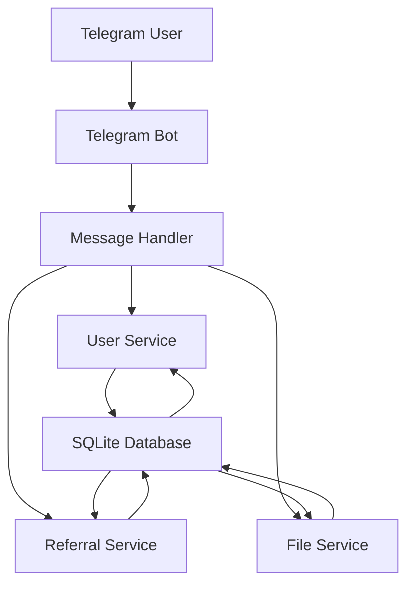

# Архитектура приложения Telegram-бота

## Обзор

Приложение представляет собой систему из двух Telegram-ботов, запущенных в Docker-контейнере с использованием SQLite в качестве базы данных. В текущем документе описывается архитектура для первого бота, который отвечает за приветствие пользователя, отправку вводного аудиофайла, предложение загрузить материалы, уведомление о создании индивидуальной программы и выдачу уникальной реферальной ссылки.

## Структура приложения

```
telegram-bot-app/
├── docker/
│   ├── Dockerfile
│   └── docker-compose.yml
├── src/
│   ├── bot/
│   │   ├── main.py
│   │   ├── handlers/
│   │   │   ├── start_handler.py
│   │   │   ├── audio_handler.py
│   │   │   ├── materials_handler.py
│   │   │   ├── program_handler.py
│   │   │   └── referral_handler.py
│   │   ├── services/
│   │   │   ├── user_service.py
│   │   │   ├── referral_service.py
│   │   │   └── file_service.py
│   │   └── utils/
│   │       ├── database.py
│   │       └── validators.py
│   ├── database/
│   │   ├── models.py
│   │   └── migrations/
│   ├── config/
│   │   └── settings.py
│   └── tests/
├── data/
│   └── db.sqlite
├── requirements.txt
└── README.md
```

## Компоненты системы

### 1. Telegram Bot Core
- Использует библиотеку python-telegram-bot
- Обрабатывает входящие сообщения и команды
- Управляет состоянием диалога с пользователем

### 2. User Service
- Автоматическая регистрация пользователей по Telegram ID
- Хранение профилей пользователей
- Управление статусами пользователей

### 3. Referral Service
- Генерация уникальных реферальных ссылок
- Отслеживание реферальных переходов
- Ассоциация пользователей с рефералами

### 4. File Service
- Хранение и обслуживание аудиофайлов
- Управление загружаемыми материалами
- Обработка запросов на скачивание

### 5. Database Layer
- SQLite база данных
- ORM для взаимодействия с данными
- Миграции схемы базы данных

## Схема взаимодействия компонентов



## Маршрутизация

Система будет использовать систему обработчиков команд и сообщений:

- `/start` - приветствие пользователя и регистрация
- Автоматическая отправка стандартного аудиофайла для всех пользователей через 4 секунды после приветственного сообщения
- Автоматическое предложение загрузить материалы через 2 секунды после отправки аудиофайла
- Автоматическое уведомление о создании индивидуальной программы после отправки материалов
- Автоматическая выдача уникальной реферальной ссылки после уведомления о программе
## Безопасность

1. **Аутентификация**: Telegram ID используется как уникальный идентификатор пользователя
2. **Защита данных**: шифрование чувствительных данных в базе данных
3. **Валидация входных данных**: проверка всех входящих сообщений и команд
4. **Защита от спама**: ограничение частоты запросов от одного пользователя
5. **Управление доступом**: разграничение прав доступа к различным функциям

## Управление состоянием

- Состояния пользовательских сессий хранятся в базе данных
- Используется FSM (Finite State Machine) для управления диалогом
- Поддержка различных состояний: NEW_USER, AWAITING_MATERIALS, AWAITING_PROGRAM и т.д.

## Интеграция с Telegram API

- Использование официального python-telegram-bot фреймворка
- Webhook или polling для получения обновлений
- Обработка различных типов сообщений (текст, аудио, документы)
- Поддержка inline клавиатур и кнопок

## Схема базы данных SQLite

```sql
-- Таблица пользователей
CREATE TABLE users (
    id INTEGER PRIMARY KEY AUTOINCREMENT,
    telegram_id INTEGER UNIQUE NOT NULL,
    username TEXT,
    first_name TEXT,
    last_name TEXT,
    referral_code TEXT UNIQUE,
    referred_by TEXT,
    created_at DATETIME DEFAULT CURRENT_TIMESTAMP,
    updated_at DATETIME DEFAULT CURRENT_TIMESTAMP
);

-- Таблица реферальных ссылок
CREATE TABLE referrals (
    id INTEGER PRIMARY KEY AUTOINCREMENT,
    referrer_telegram_id INTEGER,
    referee_telegram_id INTEGER,
    created_at DATETIME DEFAULT CURRENT_TIMESTAMP,
    FOREIGN KEY (referrer_telegram_id) REFERENCES users(telegram_id),
    FOREIGN KEY (referee_telegram_id) REFERENCES users(telegram_id)
);

-- Таблица программ
CREATE TABLE programs (
    id INTEGER PRIMARY KEY AUTOINCREMENT,
    telegram_id INTEGER,
    program_data TEXT,
    created_at DATETIME DEFAULT CURRENT_TIMESTAMP,
    FOREIGN KEY (telegram_id) REFERENCES users(telegram_id)
);

-- Таблица загруженных материалов
CREATE TABLE materials (
    id INTEGER PRIMARY KEY AUTOINCREMENT,
    name TEXT NOT NULL,
    file_path TEXT NOT NULL,
    file_type TEXT NOT NULL,
    created_at DATETIME DEFAULT CURRENT_TIMESTAMP
);
```

## Система автоматической регистрации пользователей

При получении команды `/start` или любого другого взаимодействия с ботом система:

1. Проверяет наличие пользователя в базе данных по Telegram ID
2. Если пользователь новый, создает запись в таблице `users`
3. Генерирует уникальный реферальный код
4. Проверяет, не пришел ли пользователь по реферальной ссылке
5. Отправляет приветственное сообщение

## Система генерации персонализированных реферальных ссылок

- Каждый пользователь получает уникальный реферальный код при регистрации
- Реферальная ссылка формируется как `https://t.me/bot_username?start=referral_code`
- При переходе по ссылке система связывает нового пользователя с реферером
- Реферальная статистика хранится в таблице `referrals`

## Docker-контейнер

Dockerfile будет содержать:

```
FROM python:3.9-slim

WORKDIR /app

COPY requirements.txt .
RUN pip install -r requirements.txt

COPY . .

CMD ["python", "src/bot/main.py"]
```

docker-compose.yml будет содержать:

```yaml
version: '3.8'

services:
  telegram-bot:
    build: .
    container_name: telegram-bot-app
    environment:
      - TELEGRAM_BOT_TOKEN=${TELEGRAM_BOT_TOKEN}
      - DATABASE_URL=${DATABASE_URL}
    volumes:
      - ./data:/app/data
      - ./media:/app/media
    restart: unless-stopped
```

## Подготовка к GitHub

- .gitignore для исключения временных файлов и конфиденциальных данных
- README.md с инструкциями по запуску
- requirements.txt с зависимостями
- Dockerfile и docker-compose.yml для контейнеризации
- Структура проекта, соответствующая лучшим практикам